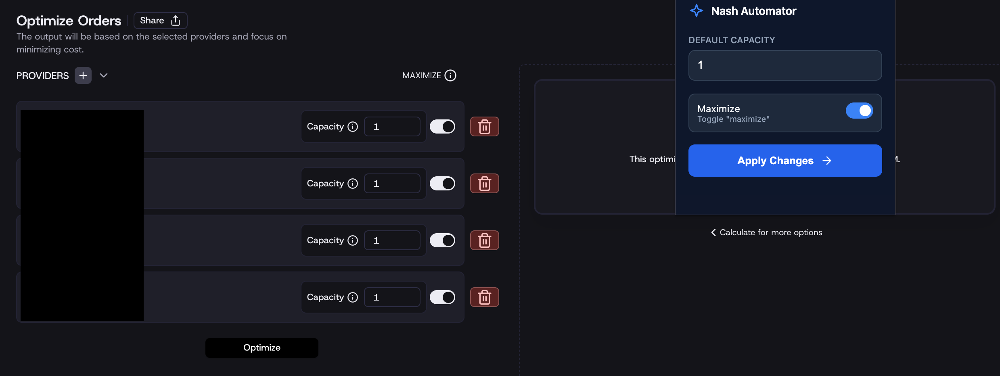

A simple automation tool to bulk-set capacities in Nash

## Purpose
This extension eliminates the need to manually type capacity numbers and click toggle switches for every individual provider during the order optimization process.

## Screenshots

*Place a screenshot of the extension in the folder and name it screenshot.png to see it here.*

## Setup & Installation
1.  **Download** or move all extension files into a single folder.
2.  Open **Google Chrome** and go to `chrome://extensions/`.
3.  Turn on **Developer mode** using the switch in the top-right corner.
4.  Click the **Load unpacked** button.
5.  Select the folder containing the extension files.
6.  **Pin** the extension to your toolbar for quick access.

## How to Use
1.  Select the orders and click the **Optimize** button.
3.  Select the **Providers**:
    *   Click this **extension** icon in your browser toolbar.
    *   Enter the desired **Capacity** (e.g., `1`).
    *   Check the **Enable Toggles** box if you want toggle maximize option.
    *   Click **Apply Changes**.
4.  The extension will instantly fill all "Capacity" fields and flip all toggles on the page for you.

---
